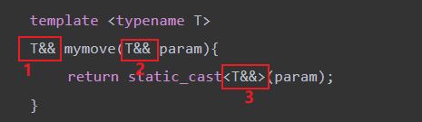
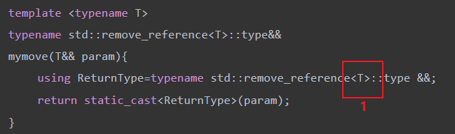
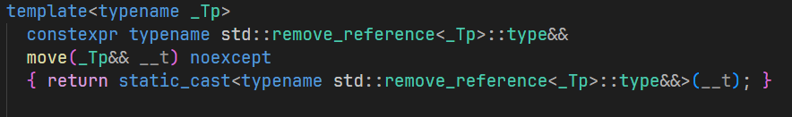
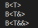

## item1：理解模板类型推导

模板的定义和调用通常如下

```cpp
template<typename T>
void f(ParamType param);

f(expr);
```

在编译期间，编译器使用expr对T和ParamType的类型进行推导

情景一：ParamType是一个指针或引用，但不是通用引用，在这种情况下

1. 如果expr是一个引用，忽略引用部分
2. 然后expr的类型与ParamType进行模式匹配来决定T

先来看一点简单的

```cpp
template<typename T>
void f(T& param);         	    //param是一个引用
int x = 27;                     
const int cx = x;               
const int& rx = x;              
f(x);                           //T是int，param的类型是int&
f(cx);                          //T是const int，param的类型是const int&
f(rx);                          //T是const int，param的类型是const int&
```

可以看到当模板是引用的时候，expr的引用性会被忽略，但是它的const性在推导的时候会被保留。这是因为如果你的expr是一个底const的引用，但是你推导的时候没有保留这个底const，那么你就可以在模板函数内部对引用绑定的那个对象进行修改，这就和它是const这一前提起了冲突。如果T前面加了const，T的类型会稍有改变，但是结果还是符合预期的

```cpp
template<typename T>
void f(const T& param);         //param现在是reference-to-const
int x = 27;                     //如之前一样
const int cx = x;               //如之前一样
const int& rx = x;              //如之前一样
f(x);                           //T是int，param的类型是const int&
f(cx);                          //T是int，param的类型是const int&
f(rx);                          //T是int，param的类型是const int&
```

接下来我们看点稀奇古怪的

```cpp
template <typename T>
void f(T* param);

int a = 42;
const int* const p = &a;
f(p);
```

考虑一下这种情况会被推导为什么类型。顶层const在作为函数参数传递的时候会被忽略，所以星号右边的那个const没用。因为ParamType是T\*，传进去的是const int\*，星号被忽略，只剩下const int，所以T是const int，param的类型是const int\*。

情景二：ParamType是一个通用引用（T&&）

1. 如果expr是左值，那么T和ParamType都会被推导为左值引用
2. 如果expr是右值，就使用情景一的推导规则

情景三：ParamType既不是指针也不是引用，在这种情况下我们通过传值的方式进行处理

1. 如果expr是个引用，忽略它的引用性
2. 如果忽略引用性之后，expr是一个const，就把const也忽略

## item7：区别使用()和{}创建对象

在c++11之前，想创建一个对象有三种方式

```cpp
// A是一个包含一个int成员的类
A a(10); // 1
A a=10; // 2
A a=(10); // 3
```

其中方式1会调用一次A的普通构造函数，方式2和3是等价的，都会调用一次A的普通构造函数和拷贝构造函数，大意如下

```cpp
A tmp(10);
A a=tmp;
```

在c++11之后引入了列表初始化，可以使用花括号对类进行初始化了，因此多了两种方式

```cpp
A a{10}; // 4
A a={10}; // 5
```

这两种方式都只会调用一次A类的普通构造函数，因此在效率上优于上述提到的方式2和方式3。此外如果有一些类根本不允许拷贝，那么久不能使用方式2和方式3创建。此外{}还有一个特点就是不允许损失精度的窄转换。**对于含有多个成员变量的类，方式2和3就都不能使用了。**

接下来看一下在函数传参和函数返回的过程中这两种创建对象的不同方法有什么区别。

首先是函数调用

```cpp
void fun1(A arg)
{
}
fun1(A(10,5)); // 1
fun1(A{10,5}); // 2
fun1({10, 5}); // 3
```

1和2都会先调用A的普通构造函数，之后由于要将参数传递给arg，因此会再调用一次A的拷贝构造函数。而3只会调用一次A的普通构造函数，也就是说这种方式直接使用10和5构造了arg，免去了拷贝的操作。

接下来是函数返回

```cpp
A fun2()
{
    // return A(10,5); // 1
    return {10, 5}; // 2
}

A MM = fun2();
```

1这种写法会调用1次普通构造函数，2次拷贝构造函数。原因还是它先在函数内部进行了一次构造，然后把构造好的对象拷贝给函数的返回值，可以理解为一个临时变量。最后再将临时变量拷贝给MM。而2这种写法只会调用一次普通构造和一次拷贝构造，就是说直接使用10和5构造了函数的返回值，然后再将这个临时变量拷贝给MM。

除此之外，{}这种写法的好处还在于它天生免疫c++令人头疼的解析问题。考虑如下代码，内容很简单，有个TimeKeeper类，使用Timer对象来进行初始化，然后1处调用TimeKeeper的构造函数。看着没什么问题，但是有些编译器对1处的解析可能存在歧义。1处的解析有下列两种说法

- 调用TimerKeeper的构造函数，使用一个匿名对象对其进行初始化
- 声明了一个函数，函数接受一个函数指针作为参数，并返回TimeKeeper对象

因此为了应对这样的歧义，我们可以使用{}对其进行改写。因为在c++中没有用{}声明函数的，因此这种写法不会有歧义。

```cpp
struct Timer
{
};

struct TimerKeeper
{
    TimerKeeper(Timer t) {}
};

TimerKeeper time_keeper(Timer()); // 1
TimerKeeper time_keeper{Timer()}; // 2
```

此外，{}还可以用于初始化聚合。首先说下聚合是什么

- 原生数组是聚合
- 类类型满足以下条件
  - 所有成员都是public的
  - 没有虚拟基类，没有private或protected的直接基类
  - 没有用户定义的构造函数(但是可以把构造函数写成default)

因为没有构造函数，所以我们在对聚合进行初始化的时候需要使用{}，以下是使用{}初始化聚合的例子

```cpp
int a2[3] = {1, 2, 3}; // 原生数组，简单类型
S a5[3] = {{1, 2}, {3, 4}, {5, 6}}; // 原生数组，复合类型，其中S是一个聚合
std::array<int, 3> a4 = {1, 2, 3}; // std::array，简单类型
```

上面的代码都可以正常运行，接下来我们看将std::array和复合类型结合起来的情况

```cpp
std::array<S, 3> a7={{1, 2}, {3, 4}, {5, 6}};      // 1 复合类型，std::array，编译失败！
std::array<S, 3> a7={1, 2, 3, 4, 5, 6}; // 2 成功
std::array<S, 3> a7={{{1, 2}, {3, 4}, {5, 6}}}; // 3 成功
```

当我们将复合类型和std::array结合在一起的时候，会发现出现了这样奇怪的问题。原因在于c++中原生数组是一个聚合，而std::array是在模仿原生数组，它的成员是一个public的原生数组，且没有定义构造函数，因此std::array也是一个聚合。秉持着一个聚合对应一对{}的理念，我们就能理解3为什么正确了。最外层的{}用于初始化std::array这个聚合，中层的{}用于初始化std::array所持有的数组成员，它也是一个聚合。最内层的花括号用于初始化数组中的复合类型。2也能成功的原因在于用{}初始化这种多重聚合的时候可以把花括号省略到只剩一对，这样编译器会自己把数据填充到聚合中。但是如果你写了更多的花括号，那就一定要写全，所以1不能通过编译。

最后一点收尾的知识。如果我们想让构造函数支持任意多个参数，我们通常会使用这种写法

```cpp
A(std::initializer_list<int> a)
{
    std::cout << "C(std::initializer_list<int> a)" << std::endl;
    for (const int *item = a.begin(); item != a.end(); ++item)
    {
    }
}
```

但是一定要注意，当你声明了这样的构造函数，然后又用{}初始化类的时候，它是一定会匹配到这个构造函数的

```cpp
// 1
A(int a,int b)
{
    std::cout << "A(int a,int b)" << std::endl;
}
// 2
A(std::initializer_list<int> a)
{
    std::cout << "C(std::initializer_list<int> a)" << std::endl;
    for (const int *item = a.begin(); item != a.end(); ++item)
    {
    }
}

A aaaa{1,2};
```

这种情况两个构造函数都能匹配上，但它会调用2。甚至有的情况掉2会报错，它还是要匹配2

```cpp
// 1
A(int a,float b)
{
    std::cout << "A(int a,float b)" << std::endl;
}

// 2
A(std::initializer_list<int> a)
{
    std::cout << "C(std::initializer_list<int> a)" << std::endl;
    for (const int *item = a.begin(); item != a.end(); ++item)
    {
    }
}

A aaaa{1,2.f}; // 3
```

我们感觉3处应该会匹配到1，但实际上会报错，它显示不允许窄转换，也就是说它还是匹配的2。

最后一点收尾

```cpp
A aaaaaaa{}; // 无参构造
A bbbbbbb({}); // std::initializer_list<int>
A ccccccc{{}}; // std::initializer_list<int>
```

## item9：优先考虑别名声明而非typedef

别名声明就是using

先来说下typename关键字。他有两个地方会使用，一个是定义模板的时候，这个用法很熟悉了

```cpp
template <typename T>
f();
```

第二个使用场景如下

```cpp
struct test1{
    // 静态成员变量也可以用作用域运算符访问
    static int SubType;
};

struct test2{
    // typedef int SubType;
    using SubType=int;
};

template <typename T>
class Myclass{
public:
    void foo(){
        // 加typename表示这是个类型成员
        typename T::SubType *ptr;
        // T::SubType *ptr;
    }
};
```

当我们想通过作用域运算符访问T内部的标识符的时候，你不能确定你访问到的是数据成员还是类型成员，而c++用作用域运算符的话，默认得到的是数据成员，所以当你用作用域运算符访问类型成员来定义变量的时候，一定要加typename。无关using还是typedef。

using比typedef好的地方在于它可以为模板类定义别名

```cpp
template <typename T>
using myVec=std::vector<T>; // 正确

template <typename T>
class Widget{
public:
	// 没有访问类内标识符，不用typename
    myVector<T> list;
};

template <typename T>
typedef std::vector<T> myVec; // 错误
```

如果要使用typedef为模板类声明别名的话，下面的写法才是正确的

```cpp
template <typename T>
struct myVector2{
    typedef std::vector<T> type;
};

template <typename T>
class Widget2{
public:
    // 这里使用作用域运算符访问模板类内部的标识符，所以还是要加typename
    typename myVector2<T>::type list;
};
```

## item23：理解std::move和std::forward

std::move只做一件事，就是不管实参是什么类型，总是把传进去的实参转成右值引用。接下来思考一下std::move是怎么实现的

由于std::move的实参能接收任何类型，所以一定使用模板实现的，形参一定是万能引用，这样才能接收任意类型。然后对形参进行类型转换，转成右值就行了。

```cpp
template <typename T>
T&& mymove(T&& param){
	return static_cast<T&&>(param);
}
```

接下来我们对其进行测试

```cpp
int &&m1=mymove(10); // 正常
int mm=10;
int &&m2=mymove(mm); // 错误
```

要分析为什么会出现这种结果，需要我们知道模板类型推导的规则。



当我们传进去一个右值10的时候，由于模板的形参是万能引用，因此T被推导为int，1处和3处的T&&就是int&&，也就是右值引用，此时是正确的。当我们传进去一个左值mm时，根据模板类型推导规则，T和param均被推导为int&，所以T&&就是int& &&，根据引用折叠规则，T& &&等于T&，所以1、2和3全部都变成了int&也就是左值引用。既然返回的是左值引用，那我们当然不能用右值引用来进行接收，所以会报错。

分析原因，传进去右值的时候是没问题的。问题在于当传进左值的时候，T会被推导为T&，然后再进行类型转换和返回的时候由于引用折叠的存在就会出问题。那有没有什么办法可以把T推导出的引用去掉呢？还真有，类型萃取里面有一个东西就可以去除引用，我们利用这个东西重写std::move

```cpp
template <typename T>
typename std::remove_reference<T>::type&&
mymove(T&& param){
	using ReturnType=typename std::remove_reference<T>::type &&;
	return static_cast<ReturnType>(param);
}
```

我们继续分析这个版本的move传入右值和左值的时候发生了什么。首先传入的是右值，那么T就是被推导为T，没有引用成分，因此去除引用成分之后得到的还是它自己，那么ReturnType就是T&&，然后我们将param转成ReturnType类型就能确保得到的结果是一个右值。为什么用typename？因为我们使用作用域运算符访问模板内部的标识符，要标明这是个类型成员。为什么返回值写那么长，因为ReturnType是在函数内部定义的，函数外访问不到所以只能写一长串。接下来看传进左值是什么情况，T根据模板类型推导和引用折叠规则，最后被推导为T&，接着使用类型萃取去除引用，得到T，所以ReturnType还是T&&，之后就是上面的流程，成功得到左值的右值引用。下面放一个标准库std::move的实现做对比





在c++14中对引用移除做了一点改进，可以帮我们省一点功夫，如下。

```cpp
template <typename T>
std::remove_reference<T>&&
mymove(T&& param){
	using ReturnType=std::remove_reference<T>&&;
	return static_cast<ReturnType>(param);
}
```

其实就是在c++14中对于这个移除引用有了如下改进

```cpp
using std::remove_reference<T>=std::remove_reference<T>::type
```

因为有了这个别名定义，我们不需要再用作用域运算符访问模板内部的标识了，所以也不用再写typename了。

接下来我们看std::remove_reference是怎么实现的，我们直接看源码

```cpp
template<typename _Tp>
struct remove_reference // 1
{ typedef _Tp   type; };

template<typename _Tp>
struct remove_reference<_Tp&> // 2
{ typedef _Tp   type; };

template<typename _Tp>
struct remove_reference<_Tp&&> // 3
{ typedef _Tp   type; };
```

我不太了解模板的语法，感觉这个像是模板的偏特化，就是如果传进去的是一个类型的话，就会匹配到1，传进去左值引用就匹配到2，传进去右值引用就匹配到3。然后类中只做一件事，就是**typedef T type**，这样T就是这个类的类型成员了，然后就可以通过作用域运算符对其进行访问了。为了验证我的想法，写了如下代码进行验证

```cpp
template <typename T>
struct B{
    void operator()(){
        std::cout<<"B<T>"<<std::endl;
    }
};

template <typename T>
struct B<T&>{
    void operator()(){
        std::cout<<"B<T&>"<<std::endl;
    }
};

template <typename T>
struct B<T&&>{
    void operator()(){
        std::cout<<"B<T&&>"<<std::endl;
    }
};

B<int>()();
B<int&>()();
B<int&&>()();
```



可以看到确实是根据传进去的模板参数的类型进行匹配的。

接下来看下std::forward的作用。加入我们想在一个函数内调用另一个函数，但是不是随便调的，我们想的是如果传进来的参数是左值引用就调左值引用版本的函数，如果是右值引用就调右值引用的函数，这个过程称为转发。

我们有如下代码

```cpp
template <typename T>
void logprocess(T &&param){
    process(param);
    // process(std::forward<T>(param));
}

void process(A &lval){
    std::cout<<"lval"<<std::endl;
}

void process(A &&rval){
    std::cout<<"rval"<<std::endl;
}

A a(42);
logprocess(a); // lval
logprocess(std::move(a)); // lval
```

我们发现传进左值的时候是正常的，传进右值的时候，T&&应该被推导为A&&也就是右值引用，那么转发的过程中应该匹配的是右值引用版本的process，但情况与我们想的不一样。原因在于param这个变量，它的类型是右值引用，但它本身是左值，所以你匹配的还是左值引用版本的函数。这个时候为了实现正确的转发，就要用到std::forward了。

我们将logprocess函数进行改写。首先来说下std::forward的作用

- std::forward\<T\>(x)：当T是一个type而不带引用时，等价于std::move(x)，也就是无脑将实参转为右值引用
- std::forward\<T\>(x)：当T是一个T&的时候什么都不做

接下来我们看，当传进去左值时，根据模板类型推导和引用折叠的规则，T和param被推导为T&，所以std::forward\<T\>(param)其实是std::forward\<T&\>(param)，此时对param什么都不做，得到的结果还是T&。

当传进去右值时，根据模板类型推导和引用折叠的规则，T被推导为T，param被推导为T&&，所以std::forward\<T\>(param)就等价于std::move(param)，这就实现了传进来的是右值就把他转成右值引用的效果。这就是完美转发。

```cpp
template <typename T>
void logprocess(T &&param){
    process(std::forward<T>(param));
}
```

